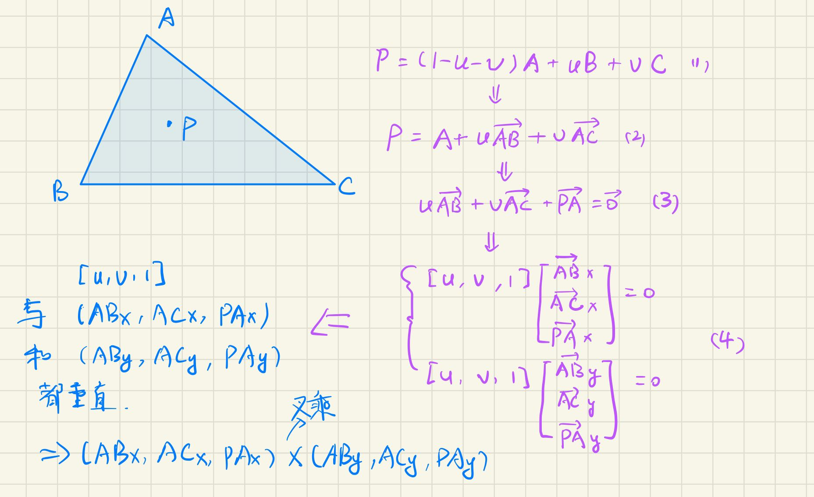
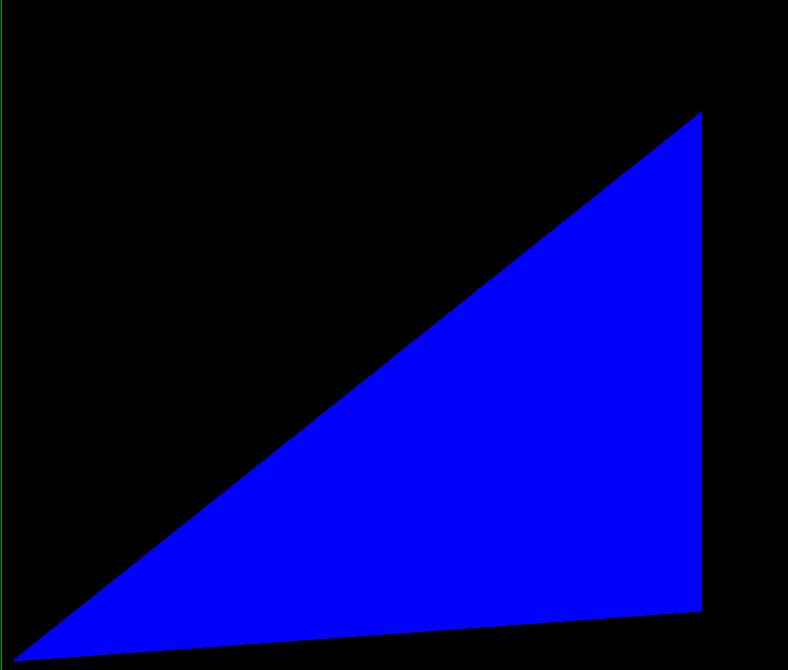
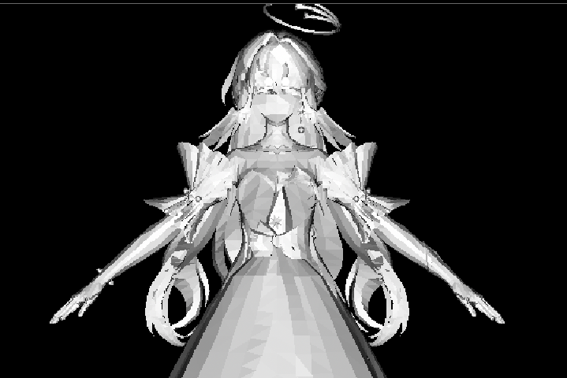
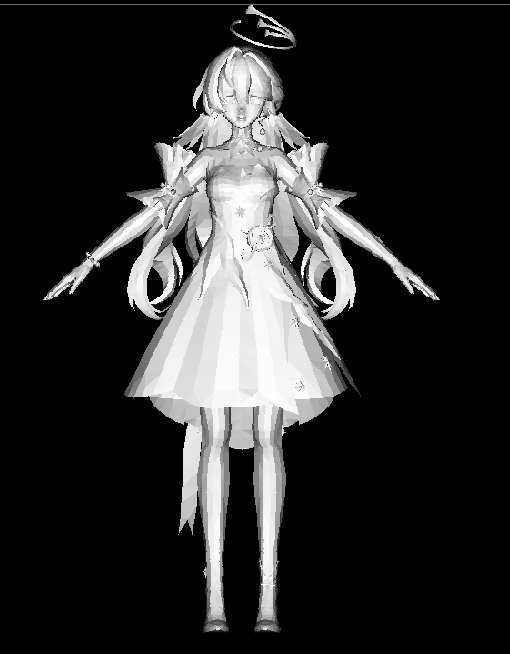

# 渲染课时1——三角形的光栅化系列


相关参考的代码：https://github.com/ssloy/tinyrenderer?tab=readme-ov-file

# 一、Lesson 1: Bresenham’s Line Drawing Algorithm

## 1. Draw line

​	这里其实可以简单说一下，在图形学中，由于光栅化的结果是离散表达的，因此绘制直线的算法并没有那么简单，在代码实现上可以直接使用Bresenham’s Line Drawing Algorithm进行绘制，具体代码不讲，太底层了，也没那么重要。

> 感兴趣的话可以去看https://github.com/ssloy/tinyrenderer/wiki/Lesson-1:-Bresenham%E2%80%99s-Line-Drawing-Algorithm这里会讲具体这个函数的迭代过程。


# 二、Lesson 2

## 1.绘制三角形

​	现在我们已经有了上面那个画线函数，一个能想到的绘制三角形的方案是依据三角形的三个顶点ABC，分别AB画一条线，BC画一条线，CA画一条线。一开始可能能想到的代码是这样的：

```c++
Vec2i t0[3] = {Vec2i(10, 70),   Vec2i(50, 160),  Vec2i(70, 80)}; 
Vec2i t1[3] = {Vec2i(180, 50),  Vec2i(150, 1),   Vec2i(70, 180)}; 
Vec2i t2[3] = {Vec2i(180, 150), Vec2i(120, 160), Vec2i(130, 180)}; 
triangle(t0[0], t0[1], t0[2], image, red); 
triangle(t1[0], t1[1], t1[2], image, white); 
triangle(t2[0], t2[1], t2[2], image, green);
```

​	如何填充所绘制的三角形的内部呢？一种方案是扫描线的方法，一行一行找到三角形的边界，然后进行填充。在参考的链接当中，考虑了很多可能存在的问题，不过本质上其实这些都是old-school style的代码，目前用**重心插值**的方法来做才是主流的方法。因此以下我们主要讨论**重心插值的方法。**

​	首先来看下面的伪代码：

```c++
triangle(vec2 points[3]) { 
    vec2 bbox[2] = find_bounding_box(points); 
    for (each pixel in the bounding box) { 
        if (inside(points, pixel)) { 
            put_pixel(pixel); 
        } 
    } 
}
```

​	这份代码是比较直观的，找到要绘制的三角形的三个顶点的包围盒，接着遍历在包围盒内部的每个像素，如果有办法判断该像素处于三角形的内部，就对其进行“上色”处理，其实这就是**光栅化**的核心思想了。

### （1）重心坐标

​	推导过程如下图（以下以二维情况为例，由于重心插值是光栅化所需要的，所以只讨论二维的情况即可）：



​	不难看出，实际上重心坐标就等于上图左下角那两个vector3的叉乘结果（当然要归一化z到1）。趁热打铁直接来看核心代码：

```c++
constexpr int width = 800; // output image size
constexpr int height = 800;

vec3 barycentric(vec2* pts, vec2 P) 
{
    vec3 u = cross(vec3(pts[2][0] - pts[0][0], pts[1][0] - pts[0][0], pts[0][0] - P[0]) , vec3(pts[2][1] - pts[0][1], pts[1][1] - pts[0][1], pts[0][1] - P[1]));  //这里的pts0是上图的A， pts1是上图的C， 算是三角形顺时针的表示
    /* `pts` and `P` has integer value as coordinates
       so `abs(u[2])` < 1 means `u[2]` is 0, that means
       triangle is degenerate, in this case return something with negative coordinates 返回带有负值的结果，此时就不会渲染这个像素的值了*/
    if (std::abs(u.z) < 1) return vec3(-1, 1, 1);
    return vec3(1.f - (u.x + u.y) / u.z, u.y / u.z, u.x / u.z);
}

void triangle(vec2 pts[3], TGAImage& image, TGAColor color)
{
    vec2 bboxmin(image.width() - 1, image.height() - 1);
    vec2 bboxmax(0, 0);
    vec2 clamp(image.width() - 1, image.height() - 1);
    for (int i = 0; i < 3; i++) {
        bboxmin.x = std::max(0.0, std::min(bboxmin.x, pts[i].x));
        bboxmin.y = std::max(0.0, std::min(bboxmin.y, pts[i].y));

        bboxmax.x = std::min(clamp.x, std::max(bboxmax.x, pts[i].x));
        bboxmax.y = std::min(clamp.y, std::max(bboxmax.y, pts[i].y));
    }
    vec2 P;
    for (P.x = bboxmin.x; P.x <= bboxmax.x; P.x++) 
    {
        for (P.y = bboxmin.y; P.y <= bboxmax.y; P.y++) 
        {
            vec3 bc_screen = barycentric(pts, P);
            if (bc_screen.x < 0 || bc_screen.y < 0 || bc_screen.z < 0) continue;
            image.set(P.x, P.y, color);
        }
    }

}

TGAColor red{ 255, 0, 0, 255, 4 }; //这里最后的4不是很重要，可以看TGAColor的源码，默认就是4
int main(int argc, char** argv) {
    TGAImage framebuffer(width, height, TGAImage::RGB); // the output image
    vec2 pts[3] = { vec2(10,10), vec2(700, 60), vec2(700, 560) };
    triangle(pts, framebuffer, red);
    framebuffer.write_tga_file("huangquanwu.tga");
    return 0;
}
```

这部分渲染的结果如下：



------


## 2.额外：绘制简单的模型

​	这里我们以任意的一个obj模型为例，通过首次提交的代码的`model.cpp`和`model.h`文件，可以看到解析这个obj文件的过程，会获得其对应的顶点和面，以及每个面对应的顶点索引，这样我们就可以获得每个顶点在模型坐标下的位置，理论上这里要进行坐标系的转换，不过我们现在还没有空间变换的概念，因此这里就先进行一个很好理解的转换：一个视口变换，把【-1，1】的模型坐标转换为【0， width】（或者【0，height】）的范围。

​	同时，我们还可以做一个模拟的Lambert效果，模拟一个光源方向，并求出每个三角形的法线方向（暂时先暴力地用AB叉乘AC这种来算法线），并实现Lambert光照效果，这部分代码如下：

```c++
vec3 light_dir(0, 0, -1);
void RenderModel(TGAImage& framebuffer)
{
    //Model model("obj/african_head.obj"); // load an object
    Model model("obj/huangquanDao.obj");
    for (int i = 0; i < model.nfaces(); i++)  // for every triangle
    {
        vec3 vert_pos[3];
        vec3 world_coords[3];
        vec2 screen_coords[3];
        for (int j : {0, 1, 2})
        {
            vert_pos[j] = model.vert(i, j);
            screen_coords[j] = vec2(static_cast<int>((vert_pos[j].x + 1.) * width / 2.), static_cast<int>((vert_pos[j].y + 1.) * height / 2.)); //暂时完全不考虑z的问题，也不考虑空间变换
            world_coords[j] = vert_pos[j];
        }
        vec3 n = cross((world_coords[2] - world_coords[0]) , (world_coords[1] - world_coords[0]));
        n = n.normalized();
        float intensity = n * light_dir;
        if (intensity > 0) 
        {
            TGAColor color{ intensity * 255, intensity * 255, intensity * 255, 255, 4 };
            triangle(screen_coords, framebuffer, color);
        }
    }
    framebuffer.write_tga_file("huangquanwu.tga");
}
```

此时我们渲染知更鸟，得到下图所示的结果：



可以看到，现在有如下的几个问题需要解决：

- （1）走样现象比较严重，需要我们未来实现一些反走样的技术；
- （2）似乎有一些面片的绘制顺序出现了错误，导致了错误的遮挡关系。


# 三、Lesson 3 Hidden faces removal (z buffer)

针对第二部分当中的问题（2），在这一部分中我们需要解决由错误的遮挡关系带来的问题，这就需要请出我们的Zbuffer。

- （1）可以尝试使用画家算法，但这里就不尝试了，画家算法带来的常见问题我们也比较清楚了。
- （2）以下是ZBuffer算法的部分


## 1.ZBuffer

​	注意我们此时默认渲染的是不透明的物体，此时ZBuffer算法的核心就是比较当前的Z值和ZBuffer当中的值的大小关系（为了方便理解，描述假设都是取了绝对值），如果Z_now < Zbuffer，说明当前绘制的像素的Z值离相机更近，此时需要更新ZBuffer的值，并将其绘制到屏幕上。对上次提交的代码做的更改如下：

```c++
void triangle(vec3 pts[3], TGAImage& image, TGAColor color, std::vector<double>& zbuffer)
{
	//...
    vec3 P; //这里的P现在改成了vec3，因为Z要存储深度
    for (P.x = bboxmin.x; P.x <= bboxmax.x; P.x++)
    {
        for (P.y = bboxmin.y; P.y <= bboxmax.y; P.y++)
        {
            vec3 bc_screen = barycentric(pts, P);
            if (bc_screen.x < 0 || bc_screen.y < 0 || bc_screen.z < 0) continue;
            //添加与ZBuffer有关的逻辑判断
            P.z = 0;
            for (int i = 0; i < 3; i++) P.z += pts[i][2] * bc_screen[i]; //相当于对深度做重心插值
            if (zbuffer[int(P.x + P.y * width)] > P.z)  //注意width指的是图像的宽（也就是有width列），height指的是图像的长（也就是有height行），而P.x指的是其在第几行，P.y指的是其在第几列
            {
                zbuffer[int(P.x + P.y * width)] = P.z;
                image.set(P.x, P.y, color);
            }
        }
    }

}
```

以上代码是ZBuffer比较的核心代码，但这里有几个注意事项需要声明，具体可以看代码的提交记录：

- （1）在`for (int i = 0; i < 3; i++) P.z += pts[i][2] * bc_screen[i];`这行代码中，bc_screen是一个三维向量，记录三角形ABC中点P的重心坐标，而`pts[i][2]`则指的是每个顶点的Z坐标值，这个值是这样赋值的：

  ```c++
  screen_coords[j] = vec3(static_cast<int>((vert_pos[j].x + 1.) * width / 2.), static_cast<int>((vert_pos[j].y + 1.) * height / 2. - 270), -vert_pos[j].z * 10); //暂时不考虑空间变换
  ```

  这里有个疑问，那就是由于我们尚未实现空间变换，因此这个“屏幕坐标”是“伪造的”，我们直接用模型坐标的Z取反 并乘10作为屏幕空间的Z坐标（乘10是为了让Z值的大小更为明显），这里读者可能会疑惑为什么z要取一个负的值，我的理解是这应该跟MVP矩阵有关，不过既然暂时还没实现MVP矩阵，先不要细究（估计就是类比转到相机空间之后Z取反了一下）。

实现了ZBuffer之后的知更鸟渲染结果如下：



可以看到，此时已经可以看到深度的关系了。


## 2.贴图

​	现在的渲染效果还是白模，我们可以尝试一下对模型进行纹理映射。对于上面的复杂模型而言，其具有多个submesh，这可以通过