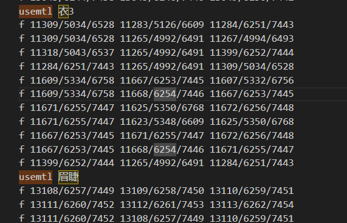

# 渲染课时1——三角形的光栅化系列


相关参考的代码：https://github.com/ssloy/tinyrenderer?tab=readme-ov-file

# 一、Lesson 1: Bresenham’s Line Drawing Algorithm

## 1. Draw line

​	这里其实可以简单说一下，在图形学中，由于光栅化的结果是离散表达的，因此绘制直线的算法并没有那么简单，在代码实现上可以直接使用Bresenham’s Line Drawing Algorithm进行绘制，具体代码不讲，太底层了，也没那么重要。

> 感兴趣的话可以去看https://github.com/ssloy/tinyrenderer/wiki/Lesson-1:-Bresenham%E2%80%99s-Line-Drawing-Algorithm这里会讲具体这个函数的迭代过程。


# 二、Lesson 2

## 1.绘制三角形

​	现在我们已经有了上面那个画线函数，一个能想到的绘制三角形的方案是依据三角形的三个顶点ABC，分别AB画一条线，BC画一条线，CA画一条线。一开始可能能想到的代码是这样的：

```c++
Vec2i t0[3] = {Vec2i(10, 70),   Vec2i(50, 160),  Vec2i(70, 80)}; 
Vec2i t1[3] = {Vec2i(180, 50),  Vec2i(150, 1),   Vec2i(70, 180)}; 
Vec2i t2[3] = {Vec2i(180, 150), Vec2i(120, 160), Vec2i(130, 180)}; 
triangle(t0[0], t0[1], t0[2], image, red); 
triangle(t1[0], t1[1], t1[2], image, white); 
triangle(t2[0], t2[1], t2[2], image, green);
```

​	如何填充所绘制的三角形的内部呢？一种方案是扫描线的方法，一行一行找到三角形的边界，然后进行填充。在参考的链接当中，考虑了很多可能存在的问题，不过本质上其实这些都是old-school style的代码，目前用**重心插值**的方法来做才是主流的方法。因此以下我们主要讨论**重心插值的方法。**

​	首先来看下面的伪代码：

```c++
triangle(vec2 points[3]) { 
    vec2 bbox[2] = find_bounding_box(points); 
    for (each pixel in the bounding box) { 
        if (inside(points, pixel)) { 
            put_pixel(pixel); 
        } 
    } 
}
```

​	这份代码是比较直观的，找到要绘制的三角形的三个顶点的包围盒，接着遍历在包围盒内部的每个像素，如果有办法判断该像素处于三角形的内部，就对其进行“上色”处理，其实这就是**光栅化**的核心思想了。

### （1）重心坐标

​	推导过程如下图（以下以二维情况为例，由于重心插值是光栅化所需要的，所以只讨论二维的情况即可）：


​	不难看出，实际上重心坐标就等于上图左下角那两个vector3的叉乘结果（当然要归一化z到1）。趁热打铁直接来看核心代码：

```c++
constexpr int width = 800; // output image size
constexpr int height = 800;

vec3 barycentric(vec2* pts, vec2 P) 
{
    vec3 u = cross(vec3(pts[2][0] - pts[0][0], pts[1][0] - pts[0][0], pts[0][0] - P[0]) , vec3(pts[2][1] - pts[0][1], pts[1][1] - pts[0][1], pts[0][1] - P[1]));  //这里的pts0是上图的A， pts1是上图的C， 算是三角形顺时针的表示
    /* `pts` and `P` has integer value as coordinates
       so `abs(u[2])` < 1 means `u[2]` is 0, that means
       triangle is degenerate, in this case return something with negative coordinates 返回带有负值的结果，此时就不会渲染这个像素的值了*/
    if (std::abs(u.z) < 1) return vec3(-1, 1, 1);
    return vec3(1.f - (u.x + u.y) / u.z, u.y / u.z, u.x / u.z);
}

void triangle(vec2 pts[3], TGAImage& image, TGAColor color)
{
    vec2 bboxmin(image.width() - 1, image.height() - 1);
    vec2 bboxmax(0, 0);
    vec2 clamp(image.width() - 1, image.height() - 1);
    for (int i = 0; i < 3; i++) {
        bboxmin.x = std::max(0.0, std::min(bboxmin.x, pts[i].x));
        bboxmin.y = std::max(0.0, std::min(bboxmin.y, pts[i].y));

        bboxmax.x = std::min(clamp.x, std::max(bboxmax.x, pts[i].x));
        bboxmax.y = std::min(clamp.y, std::max(bboxmax.y, pts[i].y));
    }
    vec2 P;
    for (P.x = bboxmin.x; P.x <= bboxmax.x; P.x++) 
    {
        for (P.y = bboxmin.y; P.y <= bboxmax.y; P.y++) 
        {
            vec3 bc_screen = barycentric(pts, P);
            if (bc_screen.x < 0 || bc_screen.y < 0 || bc_screen.z < 0) continue;
            image.set(P.x, P.y, color);
        }
    }

}

TGAColor red{ 255, 0, 0, 255, 4 }; //这里最后的4不是很重要，可以看TGAColor的源码，默认就是4
int main(int argc, char** argv) {
    TGAImage framebuffer(width, height, TGAImage::RGB); // the output image
    vec2 pts[3] = { vec2(10,10), vec2(700, 60), vec2(700, 560) };
    triangle(pts, framebuffer, red);
    framebuffer.write_tga_file("huangquanwu.tga");
    return 0;
}
```

这部分渲染的结果如下：


------


## 2.额外：绘制简单的模型

​	这里我们以任意的一个obj模型为例，通过首次提交的代码的`model.cpp`和`model.h`文件，可以看到解析这个obj文件的过程，会获得其对应的顶点和面，以及每个面对应的顶点索引，这样我们就可以获得每个顶点在模型坐标下的位置，理论上这里要进行坐标系的转换，不过我们现在还没有空间变换的概念，因此这里就先进行一个很好理解的转换：一个视口变换，把【-1，1】的模型坐标转换为【0， width】（或者【0，height】）的范围。

​	同时，我们还可以做一个模拟的Lambert效果，模拟一个光源方向，并求出每个三角形的法线方向（暂时先暴力地用AB叉乘AC这种来算法线），并实现Lambert光照效果，这部分代码如下：

```c++
vec3 light_dir(0, 0, -1);
void RenderModel(TGAImage& framebuffer)
{
    //Model model("obj/african_head.obj"); // load an object
    Model model("obj/huangquanDao.obj");
    for (int i = 0; i < model.nfaces(); i++)  // for every triangle
    {
        vec3 vert_pos[3];
        vec3 world_coords[3];
        vec2 screen_coords[3];
        for (int j : {0, 1, 2})
        {
            vert_pos[j] = model.vert(i, j);
            screen_coords[j] = vec2(static_cast<int>((vert_pos[j].x + 1.) * width / 2.), static_cast<int>((vert_pos[j].y + 1.) * height / 2.)); //暂时完全不考虑z的问题，也不考虑空间变换
            world_coords[j] = vert_pos[j];
        }
        vec3 n = cross((world_coords[2] - world_coords[0]) , (world_coords[1] - world_coords[0]));
        n = n.normalized();
        float intensity = n * light_dir;
        if (intensity > 0) 
        {
            TGAColor color{ intensity * 255, intensity * 255, intensity * 255, 255, 4 };
            triangle(screen_coords, framebuffer, color);
        }
    }
    framebuffer.write_tga_file("huangquanwu.tga");
}
```

此时我们渲染知更鸟，得到下图所示的结果：


可以看到，现在有如下的几个问题需要解决：

- （1）走样现象比较严重，需要我们未来实现一些反走样的技术；
- （2）似乎有一些面片的绘制顺序出现了错误，导致了错误的遮挡关系。


# 三、Lesson 3 Hidden faces removal (z buffer)

针对第二部分当中的问题（2），在这一部分中我们需要解决由错误的遮挡关系带来的问题，这就需要请出我们的Zbuffer。

- （1）可以尝试使用画家算法，但这里就不尝试了，画家算法带来的常见问题我们也比较清楚了。
- （2）以下是ZBuffer算法的部分


## 1.ZBuffer

​	注意我们此时默认渲染的是不透明的物体，此时ZBuffer算法的核心就是比较当前的Z值和ZBuffer当中的值的大小关系（为了方便理解，描述假设都是取了绝对值），如果Z_now < Zbuffer，说明当前绘制的像素的Z值离相机更近，此时需要更新ZBuffer的值，并将其绘制到屏幕上。对上次提交的代码做的更改如下：

```c++
void triangle(vec3 pts[3], TGAImage& image, TGAColor color, std::vector<double>& zbuffer)
{
	//...
    vec3 P; //这里的P现在改成了vec3，因为Z要存储深度
    for (P.x = bboxmin.x; P.x <= bboxmax.x; P.x++)
    {
        for (P.y = bboxmin.y; P.y <= bboxmax.y; P.y++)
        {
            vec3 bc_screen = barycentric(pts, P);
            if (bc_screen.x < 0 || bc_screen.y < 0 || bc_screen.z < 0) continue;
            //添加与ZBuffer有关的逻辑判断
            P.z = 0;
            for (int i = 0; i < 3; i++) P.z += pts[i][2] * bc_screen[i]; //相当于对深度做重心插值
            if (zbuffer[int(P.x + P.y * width)] > P.z)  //注意width指的是图像的宽（也就是有width列），height指的是图像的长（也就是有height行），而P.x指的是其在第几行，P.y指的是其在第几列
            {
                zbuffer[int(P.x + P.y * width)] = P.z;
                image.set(P.x, P.y, color);
            }
        }
    }

}
```

以上代码是ZBuffer比较的核心代码，但这里有几个注意事项需要声明，具体可以看代码的提交记录：

- （1）在`for (int i = 0; i < 3; i++) P.z += pts[i][2] * bc_screen[i];`这行代码中，bc_screen是一个三维向量，记录三角形ABC中点P的重心坐标，而`pts[i][2]`则指的是每个顶点的Z坐标值，这个值是这样赋值的：

  ```c++
  screen_coords[j] = vec3(static_cast<int>((vert_pos[j].x + 1.) * width / 2.), static_cast<int>((vert_pos[j].y + 1.) * height / 2. - 270), -vert_pos[j].z * 10); //暂时不考虑空间变换
  ```

  这里有个疑问，那就是由于我们尚未实现空间变换，因此这个“屏幕坐标”是“伪造的”，我们直接用模型坐标的Z取反 并乘10作为屏幕空间的Z坐标（乘10是为了让Z值的大小更为明显），这里读者可能会疑惑为什么z要取一个负的值，我的理解是这应该跟MVP矩阵有关，不过既然暂时还没实现MVP矩阵，先不要细究（估计就是类比转到相机空间之后Z取反了一下）。

实现了ZBuffer之后的知更鸟渲染结果如下：


可以看到，此时已经可以看到深度的关系了。


## 2.贴图

​	现在的渲染效果还是白模，我们可以尝试一下对模型进行纹理映射。对于上面的复杂模型而言，其具有多个material，每个material会控制一部分模型的着色效果，这可以通过搜索.obj文件当中的usemtl来查看，如下图：



​	这里可以看到每个f有三个值，根据wiki的介绍https://en.wikipedia.org/wiki/Wavefront_.obj_file，这里的定义是：`f v1/vt1/vn1 v2/vt2/vn2 v3/vt3/vn3 ...`，也就是说第二个参数vt1指的是纹理的坐标对应的索引值，纹理坐标对应的obj文件中的位置如下：


​	说白了这个其实就是UV坐标，那么自然而然需要在读取模型的时候记录一下对应的UV坐标和对应的材质。这里我们先简化一下，自己在obj文件的usemtl中把后面的内容改成对应的贴图文件，比如下图（其实就是偷个懒，手动改一下，方便做映射，暂时只适用于知更鸟模型）


​	此时model类中需要加入与读取纹理UV坐标以及存储每个Submesh对应的纹理UV坐标有关的代码。具体可以查看对应的commit记录，这里需要比较细心一点，以下记录一些比较有难点的部分。


### （1）难点/坑点（写过才知道坑）：

- 【错误实现，避雷】在渲染三角形内部颜色的时候，最开始我采样了三个顶点的颜色，然后算出当前渲染的像素的三角形重心坐标，依据重心坐标对颜色做加权平均，最终得到当前像素的着色结果。**但是！这样做是错误的！**这样会导致渲染得到的图整体像是糊了一样，细想一下这有点像做了双线性插值，是不正确的。==实际上，我们需要插值的是UV坐标，即对三角形的三个顶点的UV坐标依据重心坐标进行插值，此时采样得到的结果就正确了。==

正确的结果如下：


- 有根据obj文件保存每个顶点的normal方向，然后在计算中间像素的时候用顶点normal做插值，由于还没有进行空间变换，因此可能结果不够严谨，暂时来看结果是可以的，就先trick着吧。
- 【注意看】getDiffuse贴图的那个函数要注意，另外face_index相关的数组的长度其实是face的数量×3，后面写代码的时候需要注意这件事。


# 四、Lesson 4 & 5 空间变换

## 1.推导MVP矩阵和视口变化矩阵

用houdini的obj查看器查看了一下，发现比如知更鸟模型的正面Z>0，背面（例如后面的头发）Z<0，这个是模型空间的对应坐标。

### （1）Model-View

- 模型空间转世界空间，对应矩阵为世界空间下模型空间XYZ三个轴竖着放，不过这个渲染器为了方便起见省略了这一步的变化矩阵；
- 世界空间转相机空间，对应View矩阵，这里可以参考Games101的推导公式：


​	这里我们的相机是从远处往正面看的，因此相机的gaze方向的z值应当是负数。我们先来规定一下在世界空间下的相机相关参数：

```c++
const vec3       eye{ 0,0,0.5 }; // camera position
const vec3    center{ 0,0,0 }; // camera direction
const vec3        up{ 0,1,0 }; // camera up vector
```

这里的eye是上图当中的$\vec{e}$，而`normalize(center-eye)`则对应上面的$\vec{g}$，这里的$\vec{g}$对应相机空间的-z方向，相机空间的x方向对应绿色的线段，可以通过右手法则（g叉乘t）来得到，其中t一开始是up方向，于是接下来相机空间的Y方向又可以通过绿色向量叉乘g来得到，接下来把对应得到的向量写出上图的RView矩阵即可，对应下面的代码（以下代码最终求出的量即为MView）：

```c++
void lookat(const vec3 eye, const vec3 center, const vec3 up)
{
	// 这里用来计算model-view矩阵
	vec3 z = (center - eye).normalized();  //look-at direction
	vec3 x = cross(z, up).normalized();
	vec3 y = cross(x, z).normalized();
	mat<4, 4> Minv = { {{x.x,x.y,x.z,0},   {y.x,y.y,y.z,0},   {-z.x,-z.y,-z.z,0},   {0,0,0,1}} };
	mat<4, 4> Tr = { {{1,0,0,-eye.x}, {0,1,0,-eye.y}, {0,0,1,-eye.z}, {0,0,0,1}} };
	ModelView = Minv * Tr;
}
```


------

### （2）推导Projection矩阵

​	接下来要做的事情是投影，这里我们接下来就完全按照OpenGL来了，使用右手坐标系，根据https://blog.csdn.net/qq_39300235/article/details/90670282这篇文档当中所说，这个矩阵如下图所示：


​	这里的n和f都是指的是类似于OpenGL的接口，n和f都是大于0的值，且n>0，f > 0，并且要保证n的绝对值<f的绝对值，因此Projection矩阵的求导函数如下：

```c++
void projection(double left, double right, double bottom, double top, double near, double far) //near and far should be above 0
{ 
	double n = near, f = far;
	Projection = { {{2 * n / (right - left), 0, (right + left) / (right - left), 0},
                    {0, 2 * n / (top - bottom), (top + bottom)/ (top - bottom), 0},
					{0, 0, (f + n) / (n - f), 2 * f * n / (n - f)},
					{0, 0, -1, 0} } };
}
```

​	此时照理来说， [-n，-f]的z坐标会被映射到到[-1,1]（这里的n和f都是大于0的数，n表示近平面，f表示远平面，并且n的绝对值<f的绝对值）。

------

### （3）视口变化矩阵

```c++
void viewport(const int x, const int y, const int w, const int h) 
{
	Viewport = { {{w / 2., 0, 0, x + w / 2.}, {0, h / 2., 0, y + h / 2.}, {0,0,1,0}, {0,0,0,1}} };
}
```

这里其实主要用了Games101讲解的下面这个矩阵：


区别在于，我们还接上了一个偏移值x和y，不过说实话还是建议传入（0，0，width，height）比较好。

------


### （4）顶点着色器

​	在顶点着色器中，我们需要把顶点坐标从模型空间转到裁剪空间（裁剪空间理论上指的是做了透视除法之后，不过这里我们先不做透视除法，最后的gl_Position是乘了MVP矩阵之后的结果，还没有做透视除法），核心代码如下：

```c++
virtual void vertex(const int iface, const int nthvert, vec4& gl_Position)
{
   varying_uv.set_col(nthvert, model.uv(iface, nthvert));
   varying_nrm.set_col(nthvert, proj<3>((ModelView).invert_transpose() * embed<4>(model.normal(iface, nthvert), 0.)));
   gl_Position = ModelView * embed<4>(model.vert(iface, nthvert));
   view_tri.set_col(nthvert, proj<3>(gl_Position));
   gl_Position = Projection * gl_Position;
}
```

> 注意这里的法线变换，在《入门精要》中其实有说，法线的空间变换是左乘对应顶点变换矩阵的逆的转置矩阵，这可以通过上面的代码看到。
>
> 【注意】上面的varying_nrm是经过MV矩阵变换之后的结果，varying_uv包含顶点的UV坐标。


## 2.Triangle函数（更新）

接下来，我们来看一下更新后的重量级Triangle函数：

```c++
void triangle(const vec4 clip_verts[3], IShader& shader, TGAImage& image, std::vector<double>& zbuffer, int face_index)
{
	//先做窗口映射，再做透视除法，应该也没什么毛病
	vec4 pts[3] = { Viewport * clip_verts[0],    Viewport * clip_verts[1],    Viewport * clip_verts[2] };  // triangle screen coordinates before persp. division
	vec2 pts2[3] = { proj<2>(pts[0] / pts[0][3]), proj<2>(pts[1] / pts[1][3]), proj<2>(pts[2] / pts[2][3]) };  // triangle screen coordinates after  perps. division
    
    int bboxmin[2] = { image.width() - 1, image.height() - 1 };
    int bboxmax[2] = { 0, 0 };
    for (int i = 0; i < 3; i++)
        for (int j = 0; j < 2; j++) {
            bboxmin[j] = std::min(bboxmin[j], static_cast<int>(pts2[i][j]));
            bboxmax[j] = std::max(bboxmax[j], static_cast<int>(pts2[i][j]));
        }
#pragma omp parallel for
    for (int x = std::max(bboxmin[0], 0); x <= std::min(bboxmax[0], image.width() - 1); x++)
    {
        for (int y = std::max(bboxmin[1], 0); y <= std::min(bboxmax[1], image.height() - 1); y++) 
        {
            //refs:https://blog.csdn.net/Motarookie/article/details/124284471
            vec3 bc_screen = barycentric(pts2, { static_cast<double>(x), static_cast<double>(y) });
            //bc_screen 是屏幕空间计算出来的重心坐标，也就是链接中的α'，β'，γ'
            vec3 bc_clip = { bc_screen.x / pts[0][3], bc_screen.y / pts[1][3], bc_screen.z / pts[2][3] };
            //bc_clip.x + bc_clip.y + bc_clip.z 相当于1/z,见参考链接。z是屏幕空间的点P所对应的投影前的点的深度值，我们求解的目标值
            bc_clip = bc_clip / (bc_clip.x + bc_clip.y + bc_clip.z); 
            //bc_clip相当于重新计算之后的正确的重心坐标，这里比较绕，一定要对应给的链接中的公式来看
            double frag_depth = vec3{ clip_verts[0][2], clip_verts[1][2], clip_verts[2][2] }*bc_clip;
            
            if (bc_screen.x < 0 || bc_screen.y < 0 || bc_screen.z<0 || frag_depth > zbuffer[x + y * image.width()]) continue;
            TGAColor color;
            if (shader.fragment(bc_clip, color, face_index)) continue; // fragment shader can discard current fragment
            zbuffer[x + y * image.width()] = frag_depth;
            image.set(x, y, color);
        }
    }
}
```

这里的传入参数clip_verts[3]指的是还没做透视除法的顶点坐标，不过已经乘完了MVP矩阵。


- 关于透视投影矩阵的推导可以看这篇：https://www.zhyingkun.com/perspective/perspective/

- 关于重心插值深度等属性的对应说明：https://blog.csdn.net/Motarookie/article/details/124284471，这里需要额外处理的原因是经过透视投影变换之后，三角形的重心坐标应该发生了变化，此时就需要进行特殊的处理，详情可以查看链接中的推导。


## 2.【坑，请认真看】

关于透视投影之后的重心坐标以及对应的重心插值的部分推导：

```c++
```


## 3.背面剔除

根据查到的资料和GPT说的，背面剔除的思路可以是这样的：

- 在正式光栅化之前，算出三角形三个顶点屏幕映射的结果，然后用下面的程序算一下三角形的面积，从而判断其是顺时针还是逆时针，如果是逆时针则渲染，是顺时针或者是退化三角形则不渲染，核心代码如下：

```c++
enum Orientation 
{
    CLOCKWISE,
    COUNTERCLOCKWISE,
    COLLINEAR  //共线
};

Orientation checkOrientation(const vec2& A, const vec2& B, const vec2& C)
{
    // 计算有向面积
    float area = (B.x - A.x) * (C.y - A.y) - (C.x - A.x) * (B.y - A.y);

    if (area > 0) {
        return COUNTERCLOCKWISE; // 逆时针
    }
    else if (area < 0) {
        return CLOCKWISE; // 顺时针
    }
    else {
        return COLLINEAR; // 共线
    }
}


void triangle(const vec4 clip_verts[3], IShader& shader, TGAImage& image, std::vector<double>& zbuffer, int face_index)
{
    //clip_verts是NDC空间的三角形顶点坐标,还没有做透视除法
    
    //先做透视除法吧，然后再做视口变换
    vec4 pts[3] = { clip_verts[0] / clip_verts[0][3], clip_verts[1] / clip_verts[1][3], clip_verts[2] / clip_verts[2][3] };  // triangle screen coordinates before persp. division
    vec4 tmpPts2[3] = { Viewport * pts[0],    Viewport * pts[1],    Viewport * pts[2] };  // triangle screen coordinates after  perps. division
    vec2 pts2[3] = { proj<2>(tmpPts2[0]), proj<2>(tmpPts2[1]), proj<2>(tmpPts2[2]) };  // triangle screen coordinates after  perps. division
    
    // 判断顺序
    Orientation result = checkOrientation(pts2[0], pts2[1], pts2[2]);
    if(result == COLLINEAR || result == CLOCKWISE) return;
    
    int bboxmin[2] = { image.width() - 1, image.height() - 1 };
    int bboxmax[2] = { 0, 0 };
    for (int i = 0; i < 3; i++)
        for (int j = 0; j < 2; j++) {
            bboxmin[j] = std::min(bboxmin[j], static_cast<int>(pts2[i][j]));
            bboxmax[j] = std::max(bboxmax[j], static_cast<int>(pts2[i][j]));
        }
    ///..........................
}
```


# 五、使用的UI：IMGUI

对应的链接：https://github.com/ocornut/imgui/tree/docking


# 六、重要的学习资料：LearnOpenGL

官方网站：https://learnopengl-cn.github.io/01%20Getting%20started/01%20OpenGL/

## （1）通俗解释VAO，VBO，EBO

> ### 1. VBO（Vertex Buffer Object，顶点缓冲对象）
>
> - **定义**：VBO 是一种在显存中存储顶点数据的缓冲区。它通常用于存储每个顶点的属性，比如位置、颜色、法线、纹理坐标等。
> - **作用**：通过将顶点数据上传到 GPU（图形处理单元），可以提高渲染效率，因为 GPU 可以更快地访问这些数据，而不需要每次绘制时都从 CPU 传输。
> - **简单比喻**：想象一下 VBO 就像一个书架，书架上放着很多书（顶点数据），你可以根据需要快速取出书来阅读（渲染）。
>
> ### 2. VAO（Vertex Array Object，顶点数组对象）
>
> - **定义**：VAO 是一个对象，用于封装多个 VBO 的状态和配置，包括如何解释 VBO 中的数据格式（如位置数据是几维的、间隔多大等）。
> - **作用**：VAO 使得我们能够方便地管理和切换不同的顶点数据组合。在绘制之前，只需绑定相应的 VAO，OpenGL 就会知道该使用哪个 VBO 和如何读取其中的数据。
> - **简单比喻**：VAO 就像一本目录，目录告诉你哪些书在书架上，以及如何找到它们。通过查看目录，你可以快速获取所需的信息，而无需每次都去描述如何查找。
>
> ### 3. EBO（Element Buffer Object，元素缓冲对象）
>
> - **定义**：EBO 用于存储索引数据，这些索引指向 VBO 中的顶点。这样可以重用顶点，减少内存消耗和提高效率。特别是在绘制重复顶点的图形（如三角形）的情况下非常有用。
> - **作用**：使用 EBO，可以通过索引来指定要绘制的顶点，而不是直接从 VBO 中提取所有顶点。这在场景中有很多重复顶点时特别有效。
> - **简单比喻**：EBO 就像一张地图，上面标记了书架上每本书的位置。通过查看地图上的编号，你可以快速找到你要的书，而不需要每次都去找。
>
> ### 总结
>
> - **VBO** 存储实际的顶点数据。
> - **VAO** 管理和组织这些顶点数据的结构和状态。
> - **EBO** 提供了一种高效的方式来引用 VBO 中的顶点，特别是在绘制复杂图形时。
>
> 这三者结合使用，可以使 OpenGL 渲染更加高效和灵活。


### （2）介绍`glVertexAttribPointer(0, 3, GL_FLOAT, GL_FALSE, 6 * sizeof(float), (void*)0);`中的六个参数

> ### 六个参数解释
>
> 1. **第一个参数：`0`**
>    - **类型**：`GLuint`
>    - **说明**：这是顶点属性的位置索引（attribute index），指向当前 VAO 中的某个属性。索引 `0` 通常是为顶点位置分配的。如果你有多个顶点属性（例如位置、颜色、法线等），你会使用不同的索引来区分它们。
>    - **作用**：这个索引告诉 OpenGL 在着色器中要绑定哪个顶点属性。
> 2. **第二个参数：`3`**
>    - **类型**：`GLint`
>    - **说明**：表示每个顶点属性的组件数量，这里是 `3`，意味着这是一个三维向量（例如，一个包含 x、y 和 z 坐标的顶点位置）。
>    - **作用**：指示每个顶点数据包含多少个值（如一个位置由三个浮点数表示）。
> 3. **第三个参数：`GL_FLOAT`**
>    - **类型**：`GLenum`
>    - **说明**：数据类型，这里是 `GL_FLOAT`，表示每个组件的数据类型是浮点数（float）。
>    - **作用**：OpenGL 知道如何解析这些数据。
> 4. **第四个参数：`GL_FALSE`**
>    - **类型**：`GLboolean`
>    - **说明**：这个参数用于指示是否需要归一化数据。`GL_FALSE` 表示不需要归一化，这适用于浮点数数据。
>    - **作用**：如果设置为 `GL_TRUE`，那么在传递给着色器之前，OpenGL 会将整数数据（如 `GL_BYTE` 或 `GL_INT`）归一化到 [0, 1] 或 [-1, 1] 的范围内。
> 5. **第五个参数：`6 \* sizeof(float)`**
>    - **类型**：`GLsizei`
>    - **说明**：这是两个相邻顶点属性之间的步长（stride），以字节为单位。在这个例子中，它的值为 `6 * sizeof(float)`，这意味着每个顶点的所有属性总共占据了 6 个浮点数的空间。
>    - **作用**：这个参数告诉 OpenGL 从当前顶点开始，跳过多少字节才能找到下一个顶点的属性数据。通常情况下，当你有多个顶点属性时，该参数会帮助 OpenGL 找到下一个顶点属性的起始地址。
> 6. **第六个参数：`(void\*)0`**
>    - **类型**：`const void*`
>    - **说明**：这是指向顶点数组数据起始地址的偏移量。这里的 `(void*)0` 表示从缓冲区的开头开始读取数据。
>    - **作用**：当你有多个顶点属性且它们存储在同一个 VBO 中时，这个参数将帮助 OpenGL 定位每个属性的起始位置。在这个例子中，顶点位置从缓冲区的起始位置开始。
>
> ### 总结
>
> 综上所述，这个调用的主要目的是告诉 OpenGL 如何解释 VBO 中存储的顶点数据：
>
> - 使用索引 `0` 来指定第一个属性（位置）。
> - 每个位置由 `3` 个浮点数构成（x, y, z）。
> - 数据类型是浮点数，不需要归一化。
> - 相邻顶点属性之间跳过 `6 * sizeof(float)` 字节（可能是因为该顶点数据还包含其他属性如颜色）。
> - 从缓冲区的起始位置开始读取数据。
>
> 整体而言，这行代码对顶点属性进行配置，以便在渲染时能够正确地将数据传递给着色器。
